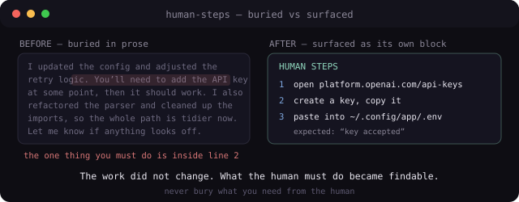

# human-steps - turn hidden human work into one clear, evidence-ready next step

  

A Claude Code skill for requested outcomes that depend on a human-only action.

## Result

The next human action is visible, concrete, and ready to run. The response also names what should be seen when the action succeeds.

## Evidence

- The action is flagged and numbered.
- Each step names a command, click, or path.
- Each step states the evidence that confirms success.
- The assistant keeps its own work out of the human step list.

## Install

Copy `SKILL.md` into `.claude/skills/human-steps/`.

## License

MIT.